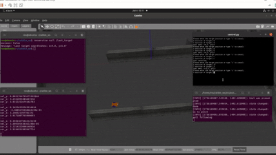

# ROS Assignment 2: Control and Monitoring Simulation Project

This project demonstrates a small yet functional system in ROS (Robot Operating System), showcasing robotic control and state monitoring using custom scripts. The project includes the following functionalities:

1. **Sending target positions to the robot using `control.py`.**
2. **Monitoring the last target received through the `last_target_service.py` service.**

The system is implemented to interact seamlessly in a simulation environment, using custom ROS nodes and services.
<p align="center">

</p>

---

## Installation

Follow these steps to install and set up the project:

### Prerequisites
- ROS Noetic installed on Ubuntu 20.04.
- A properly configured ROS workspace (`catkin_ws`).
- Python scripts placed in the `scripts/` folder of the package `assignment_2_2024`.

---

### Steps
1. **Clone the Repository**:
    ```bash
    cd ~/catkin_ws/src
    git clone https://github.com/<your_repo>/assignment_2_2024.git
    ```

2. **Make Python Scripts Executable**:
    ```bash
    chmod +x ~/catkin_ws/src/assignment_2_2024/scripts/control.py
    chmod +x ~/catkin_ws/src/assignment_2_2024/scripts/last_target_service.py
    ```

3. **Build the Workspace**:
    ```bash
    cd ~/catkin_ws
    catkin_make
    ```

4. **Source the Workspace**:
    ```bash
    source devel/setup.bash
    ```

---

## Running the Simulation

### Step 1: Launch the Simulation Environment

1. Start the system with the following command:
    ```bash
    roslaunch assignment_2_2024 assignment1.launch
    ```

2. This will:
    - Launch the simulation from `sim_w1.launch`.
    - Start the following nodes:
        - **`control.py`**: Sends target positions to the robot.
        - **`last_target_service.py`**: Monitors and provides the last received target coordinates.
        - Other existing nodes for wall following, point-to-point movement, and action services.

---

## Features

1. **Control Node (`control.py`)**:
   - Sends user-specified target coordinates to the robot using the `/move_base_simple/goal` topic.
   - Interacts with the simulation to guide the robot to a specified position.

2. **Last Target Service (`last_target_service.py`)**:
   - Subscribes to the `/last_target` topic to record the latest target coordinates sent to the robot.
   - Provides these coordinates via a Trigger service (`/last_target`).
   - Returns a message indicating the last target or a warning if no target has been set.

3. **Simulation Environment**:
   - Robot starts at an initial position (`x=0.0`, `y=1.0`).
   - Coordinates are set as ROS parameters and can be dynamically modified.

---

## Node Descriptions

### 1. **Control Node (`control.py`)**
- **Input**:
    - Target positions specified by the user (e.g., `x=3.0`, `y=5.0`).
- **Output**:
    - Publishes the goal to `/move_base_simple/goal`.
    - Confirms goal sent.

---

### 2. **Last Target Monitoring Service (`last_target_service.py`)**
- **Input**:
    - Subscribes to `/last_target` for the most recent coordinates.
- **Output**:
    - Returns the last target coordinates when requested through the `/last_target` service.

---

## Launch File Overview

The main launch file `assignment1.launch` orchestrates the entire system:
- Includes the `sim_w1.launch` simulation environment.
- Sets parameters for robot control (e.g., initial position and frequency).
- Launches all necessary nodes:
  - Wall-following and point-to-point movement services.
  - Action service for higher-level goal handling.
  - New control and monitoring services (`control.py` and `last_target_service.py`).

---

## Troubleshooting

### Common Issues:
1. **ROS Package Not Found**:
   - Ensure the package is located in the `src` folder of your workspace.
   - Run `catkin_make` and source your workspace.

2. **Node Execution Issues**:
   - Confirm scripts have execution permissions (`chmod +x`).

3. **Service or Topic Not Working**:
   - Verify active nodes and topics using:
     ```bash
     rosnode list
     rostopic list
     ```

---

## License

This project is licensed under the MIT License. See the [LICENSE](LICENSE) file for details.

---

## Future Improvements

- Add error handling for invalid user inputs in `control.py`.
- Extend the monitoring service to include timestamps or additional statistics.
- Implement real-time visualization of robot movement and target tracking.

This project provides a foundational framework for robotic control and state monitoring, ideal for learning and extending further functionalities in ROS.
